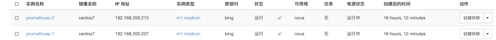
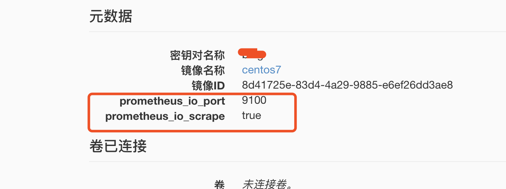
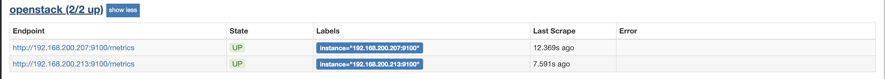

## promethues openstack discovery

>   主要介绍 promethues openstack discovery 功能实现自动监控openstack实例;

promethues [openstack_sd_config](https://prometheus.io/docs/prometheus/latest/configuration/configuration/#openstack_sd_config) plugin能够通过Nova api检索scrape目标

实践步骤
1.  在openstack中创建2台 centos7虚拟机, 把prometheus_io_scrape和prometheus_io_port元数据添加实例中;




2. 在promethues中配置openstack_sd_config;

```yaml
# 以下就是主要关键的配置项
scrape_configs:
  - job_name: "prometheus"
    static_configs:
      - targets:
          - localhost:9090
  
  - job_name: 'openstack'
    scrape_interval: 30s
    openstack_sd_configs:
      - role: instance
        region: RegionOne
        username: admin
        password: admin
        identity_endpoint: http://192.168.1.2:35357/v3
        domain_name: Default
        project_name: admin
        # default 80
        port: 9100  
    relabel_configs:
      - source_labels: [__meta_openstack_instance_status]
        action: keep
        regex: ACTIVE
      # Keep only instances which are flagged for scraping
      - source_labels: [__meta_openstack_tag_prometheus_io_scrape]
        action: keep
        regex: 'true'
      # Update the scraping port if required
      - source_labels: [__address__, __meta_openstack_tag_prometheus_io_port]
        action: replace
        regex: ([^:]+)(?::\d+)?;(\d+)
        replacement: $1:$2
        target_label: __address__
```
3. 在实例中安装node_exporter，查看promethues是否能够自动发现这2台实例；
```bash
[root@promethues-2 centos]# wget https://github.com/prometheus/node_exporter/releases/download/v0.14.0/node_exporter-0.14.0.linux-amd64.tar.gz

[root@promethues-2 centos]# tar -xvzf node_exporter-0.14.0.linux-amd64.tar.gz

[root@promethues-2 centos]# cd node_exporter-0.14.0.linux-amd64

[root@promethues-2 node_exporter-0.14.0.linux-amd64]# ./node_exporter
INFO[0000] Starting node_exporter (version=0.14.0, branch=master, revision=840ba5dcc71a084a3bc63cb6063003c1f94435a6)  source="node_exporter.go:140"
INFO[0000] Build context (go=go1.7.5, user=root@bb6d0678e7f3, date=20170321-12:12:54)  source="node_exporter.go:141"
INFO[0000] No directory specified, see --collector.textfile.directory  source="textfile.go:57"
INFO[0000] Enabled collectors:                           source="node_exporter.go:160"
INFO[0000]  - edac                                       source="node_exporter.go:162"

```

打开promethues target 查看是否能够正确发现2台虚拟机
可以看到虚拟机能够正常监控到



需要注意的几点:
* 如果在虚拟机中不添加scrape元数据，那会监控这个租户下所有的虚拟机
* all_tenants: <boolean> | default: false 可以打开这个开关,能够监控所有租户的虚拟机

参考文档: 
1. 官网配置文档[openstack_sd_config](https://prometheus.io/docs/prometheus/latest/configuration/configuration/#openstack_sd_config)
2. openstack_sd_config [实现代码](https://github.com/prometheus/prometheus/blob/master/discovery/openstack/openstack.go)